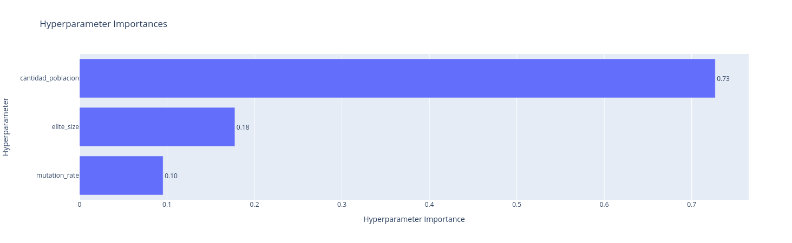
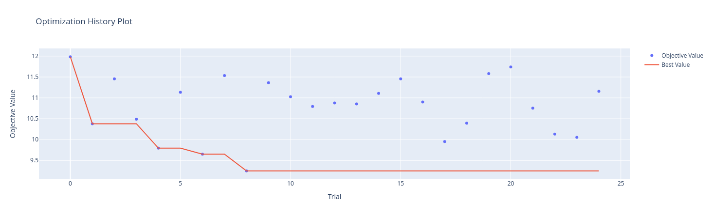

# Genetic Algorithms for the Traveling Salesman Problem (TSP)

## Introduction

The Traveling Salesman Problem (TSP) is a common challenge in optimization problems. The objective is to find the shortest possible route that visits a set of cities exactly once and returns to the starting point. TSP is known to be an NP-hard problem, requiring significant time and effort to solve. Genetic algorithms, inspired by natural selection and simulating biological evolution, are among the heuristic and metaheuristic methods used to address this problem.

## Hyperparameter Optimization

### Considerations Based on Initialization Type:

Random Initialization:

- Large population size.
- Large elite group (> 20).
- Small mutation rate (< 0.1).

Heuristic Initialization:

- Large population size.
- Smaller elite group (> 10).
- Higher mutation rate (< 0.2).

## Genetic Algorithms

### Comparison of Selection Methods

Four selection methods are compared for the TSP problem with 100 randomly generated cities:

1. Roulette Wheel Selection
2. Rank-Based Selection
3. Fitness Scaling Selection
4. Tournament Selection

#### Results

Two analyses were performed with 5000 generations under controlled conditions.

#### 1. First Analysis

Using optimized hyperparameters:
- Population: 75
- Initial Elites: 30
- Mutation: 0.1

| Selection Method   | Fitness    | Time (s)   |
|--------------------|------------|------------|
| Roulette           | 10.17926   | 44.7197    |
| Rank-Based         | 9.57252    | 46.4823    |
| Fitness Scaling    | 10.57427   | 46.79633   |
| Tournament         | 10.19824   | 46.83132   |

#### 2. Second Analysis

Allowing the selection algorithm to optimize:
- Population: 75
- Initial Elites: 1
- Mutation: 0.0001

| Selection Method   | Fitness    | Time (s)   |
|--------------------|------------|------------|
| Roulette           | 15.11379   | 66.23539   |
| Rank-Based         | 16.18321   | 69.24111   |
| Fitness Scaling    | 15.66033   | 70.13673   |
| Tournament         | 15.27754   | 70.84518   |

#### 3. Additional Analysis

Increasing generations to 10,000, the results were as follows:

| Selection Method   | Fitness    | Time (s)   |
|--------------------|------------|------------|
| Roulette           | 8.72213    | 89.6963    |
| Rank-Based         | 9.7197     | 96.86751   |
| Fitness Scaling    | 9.33449    | 98.7132    |
| Tournament         | 9.98314    | 98.80568   |

#### Discussion

All algorithms are useful for optimizing values. Proper hyperparameter selection balances diversification and intensification, ensuring an optimal solution. Incorrect hyperparameter selection can lead to issues. For example, only adding one optimal element to the new population may result in the roulette algorithm getting stuck at a high value, requiring more generations to find the optimal solution. Regardless of hyperparameter optimization, the Tournament method consistently intensifies the solution from a high level of diversification.

### Comparison of Initialization Methods

Three selection methods are compared for the TSP problem with 100 randomly generated cities:

- Random Initialization
- Heuristic Initialization
- Hybrid Initialization

#### Results

Heuristic initialization converges quickly but hybrid initialization yields better long-term results, leveraging the best of both worlds without requiring precise parameter configuration. Heuristic initialization is sensitive to parameter setup and might benefit from a mutation rate scheduler to adjust as generations increase.

| Initialization Method      | Fitness    | Time (s)   |
|----------------------------|------------|------------|
| Random Initialization      | 10.1645    | 46.60767   |
| Heuristic Initialization   | 9.82903    | 45.6934    |
| Hybrid Initialization      | 9.42396    | 46.98374   |

#### Analysis

- Random Initialization: Provides high genetic diversity initially but may require more generations to converge.
- Heuristic Initialization: Offers solutions close to optimal but reduces diversity and the ability to explore a larger solution space.
- Hybrid Initialization: Combines both methods, ensuring initial diversity followed by heuristic improvements.

## Conclusions

- Randomness helps diversify solutions initially, but relying solely on it may lead to local optima. Combining different initialization methods is beneficial.
- The number of population candidates significantly impacts diversity, execution time, and convergence.
- Tournament selection evaluates solutions based on relative performance, eliminating multiple local optima.